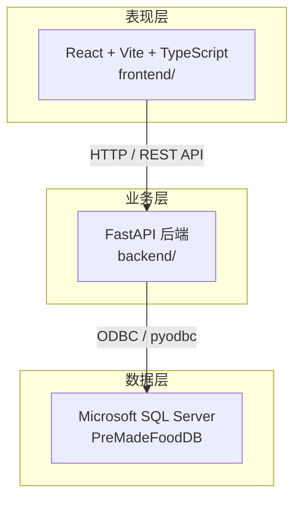
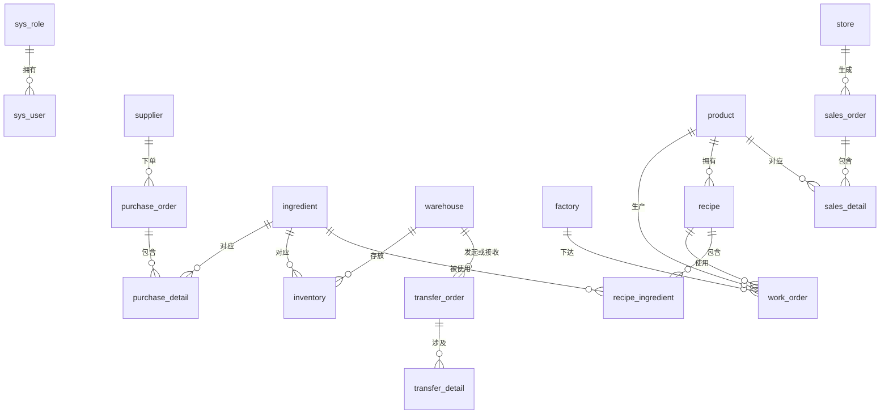

# 预制菜生产管理系统

基于 Microsoft SQL Server 数据库的预制菜企业业务管理系统，覆盖**采购、仓储、生产、销售**及**权限管理**五大业务域。系统以现有 18 张数据表为核心，为采购员、仓管员、生产人员、销售人员和管理员提供统一的数据管理与业务协同能力。

---

## 系统介绍

预制菜行业具有原料种类多、冷链存储要求高、配方版本迭代快、门店销售分散等特点。本系统面向预制菜企业的日常运营场景，将供应商管理、原料采购、冷链库存、工厂生产、门店销售等环节串联在同一套数据模型中，帮助各岗位人员：

- **采购人员**：跟踪供应商与采购订单，控制原料成本与到货进度
- **仓储人员**：掌握各温区仓库库存，及时处理低库存与临期预警，执行仓间调拨
- **生产人员**：维护产品配方与生产工单，按配方核算原料需求
- **销售人员**：管理门店销售订单，查看产品销售情况
- **管理员**：维护用户与角色权限，统筹全局业务数据

数据库脚本位于 [`er_schema.sql`](./er_schema.sql)（建表）与 [`er_seed.sql`](./er_seed.sql)（测试数据），详细表结构说明见 [`schema.md`](./schema.md)。

---

## 系统架构

系统采用经典三层架构，前端负责交互展示，后端提供 API 服务，数据库层存储业务数据。



| 层级 | 技术栈 | 目录 | 说明 |
|------|--------|------|------|
| 表现层 | React 19、Vite、TypeScript | `frontend/` | 用户界面与业务操作入口 |
| 业务层 | FastAPI、Python | `backend/` | REST API、数据库访问、业务逻辑 |
| 数据层 | SQL Server | `er_schema.sql` 等 | 18 张业务表及索引约束 |

**访问地址（本地开发）：**

| 服务 | 地址 |
|------|------|
| 前端页面 | http://localhost:5173 |
| 后端 API | http://127.0.0.1:8000 |
| API 文档 | http://127.0.0.1:8000/docs |
| 健康检查 | http://127.0.0.1:8000/api/health |

完整启动步骤见 [`Startup.md`](./Startup.md)。

---

## 数据库模块

数据库共 **18 张表**，按业务域划分如下：

| 业务域 | 核心表 | 说明 |
|--------|--------|------|
| 权限域 | `sys_role`、`sys_user` | 角色与用户，支持 Admin / Purchaser / WarehouseKeeper / SalesClerk |
| 采购域 | `supplier`、`ingredient`、`purchase_order`、`purchase_detail` | 供应商、原料主数据、采购订单及明细 |
| 仓储域 | `warehouse`、`inventory`、`transfer_order`、`transfer_detail` | 冷链仓库、库存批次、仓间调拨 |
| 生产域 | `factory`、`product`、`recipe`、`recipe_ingredient`、`work_order` | 工厂、预制菜品、配方用料、生产工单 |
| 销售域 | `store`、`sales_order`、`sales_detail` | 终端门店、销售订单及明细 |

**核心实体关系：**



**关键枚举约束（与表结构一致）：**

- 采购订单状态：`PENDING` / `APPROVED` / `COMPLETED` / `CANCELLED`
- 销售订单状态：`PENDING` / `PAID` / `SHIPPED` / `COMPLETED` / `CANCELLED`
- 仓库温区：`FROZEN`（冷冻）/ `CHILLED`（冷藏）/ `NORMAL`（常温）
- 调拨类型：`BALANCE`（均衡）/ `EMERGENCY`（紧急）/ `REPLENISH`（补货）

---

## 主要功能

以下功能均可基于现有数据表通过 SQL 查询或后续 API 页面实现，无需新增表结构。

### 1. 权限与用户管理

| 功能 | 涉及表 | 说明 |
|------|--------|------|
| 角色维护 | `sys_role` | 查看/维护 Admin、Purchaser、WarehouseKeeper、SalesClerk 四类角色 |
| 用户管理 | `sys_user` | 按角色分配账号，维护姓名、联系方式 |
| 登录鉴权 | `sys_user`、`sys_role` | 根据用户名与角色控制菜单与操作权限 |

### 2. 采购管理

| 功能 | 涉及表 | 说明 |
|------|--------|------|
| 供应商档案 | `supplier` | 维护供应商名称、联系人、地址 |
| 原料主数据 | `ingredient` | 维护原料名称、单位、类别（肉类/蔬菜/调料等）、保质期 |
| 采购订单录入 | `purchase_order`、`purchase_detail` | 创建采购单，选择供应商与原料，填写数量与单价 |
| 订单状态流转 | `purchase_order` | 待处理 → 已审批 → 已完成 / 已取消 |
| 采购金额汇总 | `purchase_order`、`purchase_detail` | 按明细自动汇总 `order_total_amount` |
| 供应商采购统计 | `purchase_order`、`purchase_detail`、`supplier` | 按供应商统计采购次数、金额、常用原料 |

### 3. 仓储管理

| 功能 | 涉及表 | 说明 |
|------|--------|------|
| 仓库档案 | `warehouse` | 维护仓库位置、容量、温区类型 |
| 库存查询 | `inventory`、`warehouse`、`ingredient` | 按仓库/原料查看当前库存、生产日期、过期日期 |
| 安全库存预警 | `inventory` | 筛选 `stock_qty < safety_stock` 的记录，生成补货提醒 |
| 临期预警 | `inventory` | 筛选即将过期的库存批次（如 7 天内到期） |
| 调拨单管理 | `transfer_order`、`transfer_detail` | 创建仓间调拨，记录调拨类型、源仓、目标仓及原料数量 |
| 库存分布分析 | `inventory`、`warehouse` | 统计各温区、各仓库的原料库存占比 |

### 4. 生产管理

| 功能 | 涉及表 | 说明 |
|------|--------|------|
| 工厂档案 | `factory` | 维护工厂名称、位置、负责人 |
| 预制菜品维护 | `product` | 维护菜品名称、类别、售价、保质期 |
| 配方管理 | `recipe`、`recipe_ingredient` | 为产品维护配方版本及每种原料用量 |
| 生产工单 | `work_order` | 记录工厂、产品、配方、生产日期与生产数量 |
| 原料需求测算 | `work_order`、`recipe_ingredient` | 根据工单产量 × 配方用料，估算所需原料 |
| 生产统计 | `work_order`、`factory`、`product` | 按工厂/产品/日期统计产量 |

### 5. 销售管理

| 功能 | 涉及表 | 说明 |
|------|--------|------|
| 门店档案 | `store` | 维护门店名称、地址、负责人 |
| 销售订单录入 | `sales_order`、`sales_detail` | 创建门店订单，选择产品与数量、单价 |
| 订单状态跟踪 | `sales_order` | 待支付 → 已支付 → 已发货 → 已完成 / 已取消 |
| 销售金额汇总 | `sales_order`、`sales_detail` | 按明细汇总订单总金额 |
| 产品销售排行 | `sales_detail`、`product` | 统计各产品销量与销售额 |
| 门店销售分析 | `sales_order`、`store` | 按门店统计订单数、销售额 |

### 6. 综合查询与报表（简易）

| 功能 | 涉及表 | 说明 |
|------|--------|------|
| 采购-库存联动 | `purchase_detail`、`inventory` | 对比近期采购量与当前库存，辅助补货决策 |
| 生产-销售对比 | `work_order`、`sales_detail` | 对比产量与销量，识别产销缺口 |
| 原料消耗分析 | `recipe_ingredient`、`sales_detail` | 根据销量反推原料理论消耗量 |
| 业务概览仪表盘 | 多表聚合 | 展示待处理采购单、低库存、临期批次、在途销售单等关键指标 |

---

## 已实现功能

系统已完成前后端联调，可通过 Web 界面进行完整的业务数据管理与状态流转。本地开发访问 http://localhost:5173 ，使用下方测试账号登录。

### 测试账号

| 用户名 | 密码 | 角色 | 说明 |
|--------|------|------|------|
| `user0001` | `Pass@123` | Admin | 管理员，可访问全部菜单 |
| `user0002` | `Pass@123` | Purchaser | 采购员 |
| `user0003` | `Pass@123` | WarehouseKeeper | 仓管员 |
| `user0004` | `Pass@123` | SalesClerk | 销售员 |

> 种子数据中 `user0001`～`user0004` 密码均为 `Pass@123`，分别对应四种角色（循环分配）。

### 前端页面

| 模块 | 页面路径 | 功能要点 |
|------|----------|----------|
| 登录 | `/login` | 用户名/密码登录，本地存储用户 ID |
| 仪表盘 | `/dashboard` | 待处理采购单、低库存、临期批次、在途销售单、近 30 天采购/销售额、产品销量 Top |
| 系统管理 | `/system/users`、`/system/roles` | 用户 CRUD、角色列表 |
| 采购 | `/purchase/suppliers` | 供应商档案 CRUD |
| 采购 | `/purchase/ingredients` | 原料主数据 CRUD |
| 采购 | `/purchase/orders` | 采购订单（嵌入明细、审批/完成/取消状态流转、自动汇总金额） |
| 仓储 | `/warehouse/warehouses` | 仓库档案 CRUD（温区类型） |
| 仓储 | `/warehouse/inventory` | 库存批次 CRUD、低库存开关、临期天数筛选 |
| 仓储 | `/warehouse/transfers` | 调拨单（嵌入明细、源仓/目标仓） |
| 生产 | `/production/factories` | 工厂档案 CRUD |
| 生产 | `/production/products` | 预制菜品 CRUD |
| 生产 | `/production/recipes` | 配方 CRUD（嵌入原料用量） |
| 生产 | `/production/work-orders` | 生产工单 CRUD、原料需求测算侧抽屉 |
| 销售 | `/sales/stores` | 门店档案 CRUD |
| 销售 | `/sales/orders` | 销售订单（嵌入明细、支付/发货/完成/取消状态流转） |

### API 速查表

所有业务接口前缀为 `/api`，需在请求头携带 `X-User-Id`（登录后由前端自动注入）。列表接口统一支持 `page`、`page_size`、`keyword` 分页参数。

#### 鉴权与系统

| 方法 | 路径 | 说明 |
|------|------|------|
| POST | `/api/auth/login` | 登录，返回 user + role |
| GET | `/api/auth/me` | 当前用户信息 |
| GET | `/api/roles` | 角色列表 |
| GET/POST/PUT/DELETE | `/api/users` | 用户 CRUD |

#### 采购

| 方法 | 路径 | 说明 |
|------|------|------|
| GET/POST/PUT/DELETE | `/api/suppliers` | 供应商 CRUD |
| GET/POST/PUT/DELETE | `/api/ingredients` | 原料 CRUD |
| GET/POST/PUT/DELETE | `/api/purchase-orders` | 采购订单 CRUD（创建/更新时嵌入 `details`） |
| POST | `/api/purchase-orders/{id}/approve` | 审批（PENDING → APPROVED） |
| POST | `/api/purchase-orders/{id}/complete` | 完成（APPROVED → COMPLETED） |
| POST | `/api/purchase-orders/{id}/cancel` | 取消 |

#### 仓储

| 方法 | 路径 | 说明 |
|------|------|------|
| GET/POST/PUT/DELETE | `/api/warehouses` | 仓库 CRUD |
| GET/POST/PUT/DELETE | `/api/inventory` | 库存 CRUD；支持 `low_stock=true`、`expiring_in_days=7` |
| GET/POST/PUT/DELETE | `/api/transfer-orders` | 调拨单 CRUD（嵌入 `details`） |

#### 生产

| 方法 | 路径 | 说明 |
|------|------|------|
| GET/POST/PUT/DELETE | `/api/factories` | 工厂 CRUD |
| GET/POST/PUT/DELETE | `/api/products` | 产品 CRUD |
| GET/POST/PUT/DELETE | `/api/recipes` | 配方 CRUD（嵌入 `ingredients`） |
| GET/POST/PUT/DELETE | `/api/work-orders` | 生产工单 CRUD |
| GET | `/api/work-orders/{id}/material-requirement` | 原料需求测算 |

#### 销售

| 方法 | 路径 | 说明 |
|------|------|------|
| GET/POST/PUT/DELETE | `/api/stores` | 门店 CRUD |
| GET/POST/PUT/DELETE | `/api/sales-orders` | 销售订单 CRUD（嵌入 `details`） |
| POST | `/api/sales-orders/{id}/pay` | 支付（PENDING → PAID） |
| POST | `/api/sales-orders/{id}/ship` | 发货（PAID → SHIPPED） |
| POST | `/api/sales-orders/{id}/complete` | 完成（SHIPPED → COMPLETED） |
| POST | `/api/sales-orders/{id}/cancel` | 取消 |
| GET | `/api/sales/product-ranking` | 产品销量排行（`limit`、`days`） |
| GET | `/api/sales/store-stats` | 门店销售统计（`days`） |

#### 仪表盘

| 方法 | 路径 | 说明 |
|------|------|------|
| GET | `/api/dashboard/overview` | 关键 KPI 与 Top 产品（并发聚合） |

#### 健康检查

| 方法 | 路径 | 说明 |
|------|------|------|
| GET | `/api/health` | 服务存活 |
| GET | `/api/health/db` | 数据库连接 |

完整交互式文档：http://127.0.0.1:8000/docs

---

## 角色使用场景

### 采购员（Purchaser）

1. 查看原料库存与安全库存，识别需补货品种
2. 选择合适供应商，创建采购订单并填写明细
3. 跟踪订单状态（待审批、已完成），核对采购金额
4. 分析各供应商的历史采购记录，优化采购策略

### 仓管员（WarehouseKeeper）

1. 按仓库、温区、原料类别查询库存
2. 处理低库存预警与临期批次，发起补货或调拨
3. 创建调拨单，在冷冻/冷藏/常温仓之间平衡库存
4. 核对采购到货后更新库存数量与批次信息

### 生产人员

1. 查看产品配方及原料用量，确认生产可行性
2. 下达生产工单，指定工厂、产品、配方版本与产量
3. 根据工单产量自动测算所需原料，与仓库库存比对
4. 统计各工厂、各产品的历史产量

### 销售人员（SalesClerk）

1. 维护门店信息与联系方式
2. 录入门店销售订单，选择产品与数量
3. 跟踪订单支付、发货、完成状态
4. 查看产品销售排行与各门店销售情况

### 管理员（Admin）

1. 管理用户账号与角色分配
2. 维护供应商、原料、仓库、工厂、产品、门店等主数据
3. 查看全局业务概览与关键预警
4. 执行数据完整性检查（如孤儿明细、金额不一致）

---

## 快速开始

### 环境要求

- Microsoft SQL Server（如 `localhost\SQLEXPRESS`）
- Python 3 + Conda 环境（后端，见 `backend/requirements.txt`）
- Node.js / npm（前端）

### 1. 初始化数据库

**方式 A：分步执行（推荐开发调试）**

```powershell
# 在 SSMS 或 sqlcmd 中依次执行
# 1. 建表与索引
er_schema.sql

# 2. 导入测试数据
er_seed.sql
```

**方式 B：一键执行**

```powershell
# 合并脚本，包含建表 + 灌数
er_schema_and_seed.sql
```

可选：取消脚本顶部注释，创建并使用 `PreMadeFoodDB` 数据库：

```sql
CREATE DATABASE PreMadeFoodDB;
GO
USE PreMadeFoodDB;
GO
```

执行完成后，各表大致数据规模：

| 表名 | 约略行数 |
|------|----------|
| `sys_role` / `sys_user` | 4 / 20 |
| `supplier` / `ingredient` | 30 / 120 |
| `purchase_order` / `purchase_detail` | 300 / 900 |
| `warehouse` / `inventory` | 8 / 500 |
| `transfer_order` / `transfer_detail` | 180 / 360 |
| `factory` / `product` / `recipe` | 6 / 80 / 80 |
| `work_order` | 500 |
| `store` / `sales_order` | 40 / 450 |

### 2. 配置后端连接

编辑 [`backend/.env`](./backend/.env)，设置 `DATABASE_URL` 指向目标数据库（默认连接 `localhost\SQLEXPRESS`）。

### 3. 启动服务

详见 [`Startup.md`](./Startup.md)。简要步骤：

```powershell
# 终端 1 — 后端
conda activate database
cd backend
python -m uvicorn app.main:app --reload --host 127.0.0.1 --port 8000

# 终端 2 — 前端
cd frontend
npm install   # 首次
npm run dev
```

---

## 项目结构

```
tjr到此一游/
├── README.md              # 本文件：系统说明
├── Startup.md             # 启动指南
├── schema.md              # 数据库详细文档
├── er_schema.sql          # 建表脚本
├── er_seed.sql            # 测试数据脚本
├── er_schema_and_seed.sql # 建表 + 灌数合并脚本
├── backend/               # FastAPI 后端
│   ├── app/
│   └── requirements.txt
└── frontend/              # React 前端
    ├── src/
    └── package.json
```

---

## 后续扩展方向

在现有表结构基础上，可进一步扩展：

| 方向 | 说明 |
|------|------|
| 成品库存 | 新增成品库存表，关联 `work_order` 入库与 `sales_detail` 出库 |
| 质量追溯 | 记录批次号，关联原料采购、生产工单与销售明细 |
| 审批流程 | 采购单、调拨单增加多级审批与操作日志 |
| 报表看板 | 可视化展示采购成本、库存周转、产销比、门店排行 |
| 扫码入库 | 结合条码/二维码，快速录入采购到货与调拨 |
| 密码加密 | 生产环境对 `sys_user.login_password` 进行哈希存储 |

---

## 相关文档

- [数据库结构详细说明](./schema.md)
- [项目启动指南](./Startup.md)
