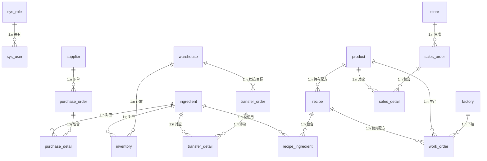

# 预制菜业务数据库结构说明

> 本文档对应 SQL 脚本：[er_schema_and_seed.sql](./er_schema_and_seed.sql)  
> 数据库平台：**Microsoft SQL Server**  
> 默认 Schema：**dbo**

---

## 1. 概述

本数据库用于支撑预制菜企业的**采购、仓储、生产、销售**及**系统权限**五大业务域。  
实体设计来源于 E-R 图，并在明显冲突处按业务合理性做了修正（如销售明细与预制菜品为 1:n、配方与原料为 m:n 等）。

### 1.1 业务域划分

| 业务域 | 核心表 | 说明 |
|--------|--------|------|
| 权限域 | `sys_role`、`sys_user` | 角色与用户管理 |
| 采购域 | `supplier`、`ingredient`、`purchase_order`、`purchase_detail` | 供应商、原料、采购单及明细 |
| 仓储域 | `warehouse`、`inventory`、`transfer_order`、`transfer_detail` | 冷链仓库、库存、调拨单及明细 |
| 生产域 | `factory`、`product`、`recipe`、`recipe_ingredient`、`work_order` | 工厂、产品、配方、用料、生产工单 |
| 销售域 | `store`、`sales_order`、`sales_detail` | 门店、销售订单及明细 |

### 1.2 表清单（共 18 张）

| 序号 | 表名 | 中文名 | 类型 |
|------|------|--------|------|
| 1 | `sys_role` | 系统角色 | 主数据 |
| 2 | `sys_user` | 系统用户 | 主数据 |
| 3 | `supplier` | 供应商 | 主数据 |
| 4 | `ingredient` | 食材原料 | 主数据（跨域共享） |
| 5 | `purchase_order` | 采购订单 | 事务 |
| 6 | `purchase_detail` | 采购明细 | 事务明细 |
| 7 | `warehouse` | 冷链仓库 | 主数据 |
| 8 | `inventory` | 库存信息 | 事务 |
| 9 | `transfer_order` | 冷链调拨单 | 事务 |
| 10 | `transfer_detail` | 调拨明细 | 事务明细 |
| 11 | `factory` | 生产工厂 | 主数据 |
| 12 | `product` | 预制菜品 | 主数据 |
| 13 | `recipe` | 产品配方 | 主数据 |
| 14 | `recipe_ingredient` | 配方用料 | 关联表（m:n） |
| 15 | `work_order` | 生产工单 | 事务 |
| 16 | `store` | 终端门店 | 主数据 |
| 17 | `sales_order` | 销售订单 | 事务 |
| 18 | `sales_detail` | 销售明细 | 事务明细 |

### 1.3 实体关系总览



---

## 2. 数据类型约定

| SQL Server 类型 | 含义 | 典型用途 |
|-----------------|------|----------|
| `VARCHAR(n)` | 定长变长 ASCII 字符串 | 编号、状态码、电话、用户名 |
| `NVARCHAR(n)` | Unicode 字符串 | 中文名称、地址、描述 |
| `INT` | 32 位整数 | 保质期天数等 |
| `DATE` | 日期（不含时间） | 订单日期、生产日期 |
| `DECIMAL(12,2)` | 定点数，12 位总长度、2 位小数 | 数量、金额、容量 |

---

## 3. 表结构详情

### 3.1 权限域

#### 3.1.1 `sys_role`（系统角色）

| 属性名 | 中文名 | 域 | 约束 | 说明 |
|--------|--------|-----|------|------|
| `role_id` | 角色编号 | `VARCHAR(20)` | **PK**, NOT NULL | 主键，如 `ROL001` |
| `role_name` | 角色名称 | `NVARCHAR(50)` | NOT NULL | 如 Admin、Purchaser |
| `permission_desc` | 权限说明 | `NVARCHAR(200)` | NULL | 角色权限描述 |

**索引：** 无额外非聚集索引（主键聚集索引）

---

#### 3.1.2 `sys_user`（系统用户）

| 属性名 | 中文名 | 域 | 约束 | 说明 |
|--------|--------|-----|------|------|
| `user_id` | 用户编号 | `VARCHAR(20)` | **PK**, NOT NULL | 主键，如 `USR0001` |
| `role_id` | 角色编号 | `VARCHAR(20)` | **FK**, NOT NULL | 引用 `sys_role(role_id)` |
| `username` | 用户名 | `VARCHAR(50)` | NOT NULL, **UNIQUE** | 登录账号，全局唯一 |
| `login_password` | 登录密码 | `VARCHAR(100)` | NOT NULL | 密码（生产环境应加密存储） |
| `real_name` | 真实姓名 | `NVARCHAR(50)` | NOT NULL | |
| `contact_phone` | 联系电话 | `VARCHAR(20)` | NOT NULL | |

**外键：**

| 约束名 | 本表字段 | 引用表.字段 |
|--------|----------|-------------|
| `fk_sys_user_role` | `role_id` | `sys_role.role_id` |

**关系：** 系统角色 1:n 系统用户（一个角色可对应多个用户）

---

### 3.2 采购域

#### 3.2.1 `supplier`（供应商）

| 属性名 | 中文名 | 域 | 约束 | 说明 |
|--------|--------|-----|------|------|
| `supplier_id` | 供应商编号 | `VARCHAR(20)` | **PK**, NOT NULL | 如 `SUP0001` |
| `supplier_name` | 供应商名称 | `NVARCHAR(100)` | NOT NULL, **UNIQUE** | 名称不可重复 |
| `contact_person` | 联系人 | `NVARCHAR(50)` | NOT NULL | |
| `contact_phone` | 联系电话 | `VARCHAR(20)` | NOT NULL | |
| `address` | 地址 | `NVARCHAR(200)` | NOT NULL | |

---

#### 3.2.2 `ingredient`（食材原料）

> 跨采购、仓储、生产域共享的核心主数据表。

| 属性名 | 中文名 | 域 | 约束 | 说明 |
|--------|--------|-----|------|------|
| `ingredient_id` | 原料编号 | `VARCHAR(20)` | **PK**, NOT NULL | 如 `ING0001` |
| `ingredient_name` | 原料名称 | `NVARCHAR(100)` | NOT NULL | |
| `unit` | 计量单位 | `NVARCHAR(20)` | NOT NULL | 如 kg、box、pack |
| `category` | 原料类别 | `NVARCHAR(50)` | NOT NULL | 如 Meat、Vegetable |
| `shelf_life_days` | 保质期（天） | `INT` | NOT NULL, CHECK > 0 | 必须为正整数 |

**检查约束：** `ck_ingredient_shelf_life`：`shelf_life_days > 0`

---

#### 3.2.3 `purchase_order`（采购订单）

| 属性名 | 中文名 | 域 | 约束 | 说明 |
|--------|--------|-----|------|------|
| `purchase_order_id` | 采购订单编号 | `VARCHAR(20)` | **PK**, NOT NULL | 如 `PO000001` |
| `supplier_id` | 供应商编号 | `VARCHAR(20)` | **FK**, NOT NULL | 引用 `supplier(supplier_id)` |
| `order_date` | 下单日期 | `DATE` | NOT NULL | |
| `order_total_amount` | 订单总金额 | `DECIMAL(12,2)` | NOT NULL, DEFAULT 0, CHECK >= 0 | 可由明细汇总更新 |
| `order_status` | 订单状态 | `VARCHAR(20)` | NOT NULL, CHECK 枚举 | 见下表 |

**订单状态枚举（`ck_purchase_order_status`）：**

| 值 | 含义 |
|----|------|
| `PENDING` | 待处理 |
| `APPROVED` | 已审批 |
| `COMPLETED` | 已完成 |
| `CANCELLED` | 已取消 |

**外键：** `fk_purchase_order_supplier` → `supplier.supplier_id`  
**索引：** `ix_purchase_order_supplier(supplier_id)`

**关系：** 供应商 1:n 采购订单

---

#### 3.2.4 `purchase_detail`（采购明细）

| 属性名 | 中文名 | 域 | 约束 | 说明 |
|--------|--------|-----|------|------|
| `purchase_detail_id` | 采购明细编号 | `VARCHAR(20)` | **PK**, NOT NULL | 如 `POD000001` |
| `purchase_order_id` | 采购订单编号 | `VARCHAR(20)` | **FK**, NOT NULL | 引用 `purchase_order` |
| `ingredient_id` | 原料编号 | `VARCHAR(20)` | **FK**, NOT NULL | 引用 `ingredient` |
| `purchase_qty` | 采购数量 | `DECIMAL(12,2)` | NOT NULL, CHECK > 0 | |
| `purchase_unit_price` | 采购单价 | `DECIMAL(12,2)` | NOT NULL, CHECK > 0 | |

**唯一约束：** `uq_purchase_order_ingredient (purchase_order_id, ingredient_id)` — 同一采购单中同一原料仅一行  
**外键：**
- `fk_purchase_detail_order` → `purchase_order.purchase_order_id`
- `fk_purchase_detail_ingredient` → `ingredient.ingredient_id`

**索引：**
- `ix_purchase_detail_order(purchase_order_id)`
- `ix_purchase_detail_ingredient(ingredient_id)`

**关系：**
- 采购订单 1:n 采购明细
- 食材原料 1:n 采购明细

---

### 3.3 仓储域

#### 3.3.1 `warehouse`（冷链仓库）

| 属性名 | 中文名 | 域 | 约束 | 说明 |
|--------|--------|-----|------|------|
| `warehouse_id` | 仓库编号 | `VARCHAR(20)` | **PK**, NOT NULL | 如 `WAR0001` |
| `warehouse_name` | 仓库名称 | `NVARCHAR(100)` | NOT NULL, **UNIQUE** | |
| `warehouse_location` | 仓库位置 | `NVARCHAR(200)` | NOT NULL | |
| `warehouse_capacity` | 仓库容量 | `DECIMAL(12,2)` | NOT NULL, CHECK > 0 | |
| `temperature_type` | 温区类型 | `VARCHAR(20)` | NOT NULL, CHECK 枚举 | 见下表 |

**温区类型枚举（`ck_warehouse_temp`）：**

| 值 | 含义 |
|----|------|
| `FROZEN` | 冷冻 |
| `CHILLED` | 冷藏 |
| `NORMAL` | 常温 |

---

#### 3.3.2 `inventory`（库存信息）

| 属性名 | 中文名 | 域 | 约束 | 说明 |
|--------|--------|-----|------|------|
| `inventory_id` | 库存编号 | `VARCHAR(20)` | **PK**, NOT NULL | 如 `INV000001` |
| `warehouse_id` | 仓库编号 | `VARCHAR(20)` | **FK**, NOT NULL | 引用 `warehouse` |
| `ingredient_id` | 原料编号 | `VARCHAR(20)` | **FK**, NOT NULL | 引用 `ingredient` |
| `stock_qty` | 库存数量 | `DECIMAL(12,2)` | NOT NULL, CHECK >= 0 | |
| `production_date` | 生产日期 | `DATE` | NOT NULL | |
| `expiry_date` | 过期日期 | `DATE` | NOT NULL, CHECK >= production_date | |
| `safety_stock` | 安全库存 | `DECIMAL(12,2)` | NOT NULL, CHECK >= 0 | 低于此值需补货 |

**外键：**
- `fk_inventory_warehouse` → `warehouse.warehouse_id`
- `fk_inventory_ingredient` → `ingredient.ingredient_id`

**索引：**
- `ix_inventory_warehouse(warehouse_id)`
- `ix_inventory_ingredient(ingredient_id)`

**关系：**
- 冷链仓库 1:n 库存信息
- 食材原料 1:n 库存信息

---

#### 3.3.3 `transfer_order`（冷链调拨单）

| 属性名 | 中文名 | 域 | 约束 | 说明 |
|--------|--------|-----|------|------|
| `transfer_order_id` | 调拨单编号 | `VARCHAR(20)` | **PK**, NOT NULL | 如 `TO000001` |
| `source_warehouse_id` | 源仓库编号 | `VARCHAR(20)` | **FK**, NOT NULL | 引用 `warehouse` |
| `target_warehouse_id` | 目标仓库编号 | `VARCHAR(20)` | **FK**, NOT NULL | 引用 `warehouse` |
| `transfer_date` | 调拨日期 | `DATE` | NOT NULL | |
| `transfer_type` | 调拨类型 | `VARCHAR(20)` | NOT NULL, CHECK 枚举 | 见下表 |

**调拨类型枚举（`ck_transfer_type`）：**

| 值 | 含义 |
|----|------|
| `BALANCE` | 均衡调拨 |
| `EMERGENCY` | 紧急调拨 |
| `REPLENISH` | 补货调拨 |

**业务约束：** `ck_transfer_diff_warehouse`：`source_warehouse_id <> target_warehouse_id`（源仓与目标仓不能相同）

**外键：**
- `fk_transfer_source` → `warehouse.warehouse_id`
- `fk_transfer_target` → `warehouse.warehouse_id`

**索引：**
- `ix_transfer_order_source(source_warehouse_id)`
- `ix_transfer_order_target(target_warehouse_id)`

**关系：** 冷链仓库 1:n 冷链调拨单（分别作为发起仓与目标仓）

---

#### 3.3.4 `transfer_detail`（调拨明细）

| 属性名 | 中文名 | 域 | 约束 | 说明 |
|--------|--------|-----|------|------|
| `transfer_detail_id` | 调拨明细编号 | `VARCHAR(20)` | **PK**, NOT NULL | 如 `TOD000001` |
| `transfer_order_id` | 调拨单编号 | `VARCHAR(20)` | **FK**, NOT NULL | 引用 `transfer_order` |
| `ingredient_id` | 原料编号 | `VARCHAR(20)` | **FK**, NOT NULL | 引用 `ingredient` |
| `transfer_qty` | 调拨数量 | `DECIMAL(12,2)` | NOT NULL, CHECK > 0 | |

**唯一约束：** `uq_transfer_order_ingredient (transfer_order_id, ingredient_id)`  
**外键：**
- `fk_transfer_detail_order` → `transfer_order.transfer_order_id`
- `fk_transfer_detail_ingredient` → `ingredient.ingredient_id`

**索引：** `ix_transfer_detail_order(transfer_order_id)`

**关系：**
- 冷链调拨单 1:n 调拨明细
- 食材原料 1:n 调拨明细

---

### 3.4 生产域

#### 3.4.1 `factory`（生产工厂）

| 属性名 | 中文名 | 域 | 约束 | 说明 |
|--------|--------|-----|------|------|
| `factory_id` | 工厂编号 | `VARCHAR(20)` | **PK**, NOT NULL | 如 `FAC0001` |
| `factory_name` | 工厂名称 | `NVARCHAR(100)` | NOT NULL | |
| `factory_location` | 工厂位置 | `NVARCHAR(200)` | NOT NULL | |
| `manager_name` | 负责人 | `NVARCHAR(50)` | NOT NULL | |
| `contact_phone` | 联系电话 | `VARCHAR(20)` | NOT NULL | |

---

#### 3.4.2 `product`（预制菜品）

| 属性名 | 中文名 | 域 | 约束 | 说明 |
|--------|--------|-----|------|------|
| `product_id` | 产品编号 | `VARCHAR(20)` | **PK**, NOT NULL | 如 `PRO0001` |
| `product_name` | 产品名称 | `NVARCHAR(100)` | NOT NULL, **UNIQUE** | |
| `product_category` | 产品类别 | `NVARCHAR(50)` | NOT NULL | 如 StirFry、Soup |
| `sales_price` | 销售价格 | `DECIMAL(12,2)` | NOT NULL, CHECK > 0 | |
| `shelf_life_days` | 保质期（天） | `INT` | NOT NULL, CHECK > 0 | |

---

#### 3.4.3 `recipe`（产品配方）

| 属性名 | 中文名 | 域 | 约束 | 说明 |
|--------|--------|-----|------|------|
| `recipe_id` | 配方编号 | `VARCHAR(20)` | **PK**, NOT NULL | 如 `REC0001` |
| `product_id` | 产品编号 | `VARCHAR(20)` | **FK**, NOT NULL | 引用 `product` |
| `recipe_name` | 配方名称 | `NVARCHAR(100)` | NOT NULL | |
| `recipe_version` | 配方版本 | `VARCHAR(20)` | NOT NULL | 如 v1.0 |

**唯一约束：** `uq_recipe_product_version (product_id, recipe_version)` — 同一产品同一版本仅一条配方  
**外键：** `fk_recipe_product` → `product.product_id`  
**索引：** `ix_recipe_product(product_id)`

**关系：** 预制菜品 1:n 产品配方

---

#### 3.4.4 `recipe_ingredient`（配方用料）

> 产品配方与食材原料的 **m:n** 关联表。

| 属性名 | 中文名 | 域 | 约束 | 说明 |
|--------|--------|-----|------|------|
| `recipe_id` | 配方编号 | `VARCHAR(20)` | **PK**, **FK**, NOT NULL | 复合主键之一 |
| `ingredient_id` | 原料编号 | `VARCHAR(20)` | **PK**, **FK**, NOT NULL | 复合主键之一 |
| `ingredient_qty` | 原料用量 | `DECIMAL(12,2)` | NOT NULL, CHECK > 0 | 该配方中该原料的用量 |

**主键：** `pk_recipe_ingredient (recipe_id, ingredient_id)`  
**外键：**
- `fk_recipe_ingredient_recipe` → `recipe.recipe_id`
- `fk_recipe_ingredient_ingredient` → `ingredient.ingredient_id`

**索引：** `ix_recipe_ingredient_ingredient(ingredient_id)`

---

#### 3.4.5 `work_order`（生产工单）

| 属性名 | 中文名 | 域 | 约束 | 说明 |
|--------|--------|-----|------|------|
| `work_order_id` | 工单编号 | `VARCHAR(20)` | **PK**, NOT NULL | 如 `WO000001` |
| `factory_id` | 工厂编号 | `VARCHAR(20)` | **FK**, NOT NULL | 引用 `factory` |
| `product_id` | 产品编号 | `VARCHAR(20)` | **FK**, NOT NULL | 引用 `product` |
| `recipe_id` | 配方编号 | `VARCHAR(20)` | **FK**, NOT NULL | 引用 `recipe` |
| `production_date` | 生产日期 | `DATE` | NOT NULL | |
| `production_qty` | 生产数量 | `DECIMAL(12,2)` | NOT NULL, CHECK > 0 | |

**外键：**
- `fk_work_order_factory` → `factory.factory_id`
- `fk_work_order_product` → `product.product_id`
- `fk_work_order_recipe` → `recipe.recipe_id`

**索引：**
- `ix_work_order_factory(factory_id)`
- `ix_work_order_product(product_id)`
- `ix_work_order_recipe(recipe_id)`

**关系：**
- 生产工厂 1:n 生产工单
- 预制菜品 1:n 生产工单
- 产品配方 1:n 生产工单

---

### 3.5 销售域

#### 3.5.1 `store`（终端门店）

| 属性名 | 中文名 | 域 | 约束 | 说明 |
|--------|--------|-----|------|------|
| `store_id` | 门店编号 | `VARCHAR(20)` | **PK**, NOT NULL | 如 `STO0001` |
| `store_name` | 门店名称 | `NVARCHAR(100)` | NOT NULL, **UNIQUE** | |
| `store_address` | 门店地址 | `NVARCHAR(200)` | NOT NULL | |
| `store_manager` | 负责人 | `NVARCHAR(50)` | NOT NULL | |
| `contact_phone` | 联系电话 | `VARCHAR(20)` | NOT NULL | |

---

#### 3.5.2 `sales_order`（销售订单）

| 属性名 | 中文名 | 域 | 约束 | 说明 |
|--------|--------|-----|------|------|
| `sales_order_id` | 销售订单编号 | `VARCHAR(20)` | **PK**, NOT NULL | 如 `SO000001` |
| `store_id` | 门店编号 | `VARCHAR(20)` | **FK**, NOT NULL | 引用 `store` |
| `order_date` | 下单日期 | `DATE` | NOT NULL | |
| `order_total_amount` | 订单总金额 | `DECIMAL(12,2)` | NOT NULL, DEFAULT 0, CHECK >= 0 | 可由明细汇总更新 |
| `order_status` | 订单状态 | `VARCHAR(20)` | NOT NULL, CHECK 枚举 | 见下表 |

**订单状态枚举（`ck_sales_order_status`）：**

| 值 | 含义 |
|----|------|
| `PENDING` | 待支付 |
| `PAID` | 已支付 |
| `SHIPPED` | 已发货 |
| `COMPLETED` | 已完成 |
| `CANCELLED` | 已取消 |

**外键：** `fk_sales_order_store` → `store.store_id`  
**索引：** `ix_sales_order_store(store_id)`

**关系：** 终端门店 1:n 销售订单

---

#### 3.5.3 `sales_detail`（销售明细）

| 属性名 | 中文名 | 域 | 约束 | 说明 |
|--------|--------|-----|------|------|
| `sales_detail_id` | 销售明细编号 | `VARCHAR(20)` | **PK**, NOT NULL | 如 `SOD000001` |
| `sales_order_id` | 销售订单编号 | `VARCHAR(20)` | **FK**, NOT NULL | 引用 `sales_order` |
| `product_id` | 产品编号 | `VARCHAR(20)` | **FK**, NOT NULL | 引用 `product` |
| `sales_qty` | 销售数量 | `DECIMAL(12,2)` | NOT NULL, CHECK > 0 | |
| `sales_unit_price` | 销售单价 | `DECIMAL(12,2)` | NOT NULL, CHECK > 0 | 可不同于产品标价 |

**唯一约束：** `uq_sales_order_product (sales_order_id, product_id)` — 同一订单中同一产品仅一行明细  
**外键：**
- `fk_sales_detail_order` → `sales_order.sales_order_id`
- `fk_sales_detail_product` → `product.product_id`

**索引：**
- `ix_sales_detail_order(sales_order_id)`
- `ix_sales_detail_product(product_id)`

**关系：**
- 销售订单 1:n 销售明细
- 预制菜品 1:n 销售明细（每条明细仅对应一个产品）

---

## 4. 外键依赖与删除顺序

脚本按**子表优先**顺序 DROP，建表时按**父表优先**顺序 CREATE。  
手动维护数据或删表时，建议遵循以下依赖层级（自上而下为父表）：

```
第 1 层（无业务外键依赖）:
  sys_role, supplier, ingredient, warehouse, factory, product, store

第 2 层:
  sys_user → sys_role
  purchase_order → supplier
  recipe → product
  inventory → warehouse, ingredient

第 3 层:
  purchase_detail → purchase_order, ingredient
  transfer_order → warehouse (×2)
  recipe_ingredient → recipe, ingredient
  work_order → factory, product, recipe
  sales_order → store

第 4 层:
  transfer_detail → transfer_order, ingredient
  sales_detail → sales_order, product
```

**维护建议：** 删除主数据前，先确认无子表引用；或使用级联策略（当前脚本未启用 ON DELETE CASCADE，需手动处理）。

---

## 5. 索引汇总

| 索引名 | 表 | 字段 | 用途 |
|--------|-----|------|------|
| `ix_purchase_order_supplier` | `purchase_order` | `supplier_id` | 按供应商查采购单 |
| `ix_purchase_detail_order` | `purchase_detail` | `purchase_order_id` | 按订单查明细 |
| `ix_purchase_detail_ingredient` | `purchase_detail` | `ingredient_id` | 按原料查采购记录 |
| `ix_inventory_warehouse` | `inventory` | `warehouse_id` | 按仓库查库存 |
| `ix_inventory_ingredient` | `inventory` | `ingredient_id` | 按原料查库存 |
| `ix_transfer_order_source` | `transfer_order` | `source_warehouse_id` | 按源仓查调拨 |
| `ix_transfer_order_target` | `transfer_order` | `target_warehouse_id` | 按目标仓查调拨 |
| `ix_transfer_detail_order` | `transfer_detail` | `transfer_order_id` | 按调拨单查明细 |
| `ix_recipe_product` | `recipe` | `product_id` | 按产品查配方 |
| `ix_recipe_ingredient_ingredient` | `recipe_ingredient` | `ingredient_id` | 按原料查配方 |
| `ix_work_order_factory` | `work_order` | `factory_id` | 按工厂查工单 |
| `ix_work_order_product` | `work_order` | `product_id` | 按产品查工单 |
| `ix_work_order_recipe` | `work_order` | `recipe_id` | 按配方查工单 |
| `ix_sales_order_store` | `sales_order` | `store_id` | 按门店查订单 |
| `ix_sales_detail_order` | `sales_detail` | `sales_order_id` | 按订单查明细 |
| `ix_sales_detail_product` | `sales_detail` | `product_id` | 按产品查销售 |

---

## 6. 实例数据规模（脚本默认）

执行 `er_schema_and_seed.sql` 后，各表大致行数如下（用于验收参考）：

| 表名 | 约略行数 |
|------|----------|
| `sys_role` | 4 |
| `sys_user` | 20 |
| `supplier` | 30 |
| `ingredient` | 120 |
| `purchase_order` | 300 |
| `purchase_detail` | 900 |
| `warehouse` | 8 |
| `inventory` | 500 |
| `transfer_order` | 180 |
| `transfer_detail` | 360 |
| `factory` | 6 |
| `product` | 80 |
| `recipe` | 80 |
| `recipe_ingredient` | 320 |
| `work_order` | 500 |
| `store` | 40 |
| `sales_order` | 450 |
| `sales_detail` | 约 1350~1800 |
| **合计** | **约 5200+** |

脚本末尾提供各表 `COUNT(*)` 及总元组数统计，可直接运行验证。

---

## 7. DBA 维护要点

### 7.1 部署与重建

1. 可选：取消脚本顶部注释，创建并使用 `PreMadeFoodDB` 数据库。
2. 脚本会先 DROP 再 CREATE，**会清空已有数据**，生产环境请谨慎执行。
3. 建议在 SSMS 或 `sqlcmd` 中整文件执行。

### 7.2 订单金额一致性

- `purchase_order.order_total_amount` 与 `sales_order.order_total_amount` 在灌数时由明细汇总 UPDATE。
- 若手工增删明细，需同步更新头表金额，例如：

```sql
UPDATE po
SET order_total_amount = d.total_amt
FROM dbo.purchase_order po
JOIN (
    SELECT purchase_order_id, SUM(purchase_qty * purchase_unit_price) AS total_amt
    FROM dbo.purchase_detail
    GROUP BY purchase_order_id
) d ON d.purchase_order_id = po.purchase_order_id;
```

### 7.3 完整性巡检

脚本已包含孤儿记录检查示例，可定期扩展为全表外键巡检：

```sql
-- 销售明细是否存在无头订单
SELECT COUNT(*) AS orphan_sales_detail
FROM dbo.sales_detail d
LEFT JOIN dbo.sales_order o ON o.sales_order_id = d.sales_order_id
WHERE o.sales_order_id IS NULL;
```

### 7.4 主数据删除注意

| 操作 | 风险 | 建议 |
|------|------|------|
| 删除 `ingredient` | 影响采购明细、库存、配方用料、调拨明细 | 先查引用计数，或逻辑停用 |
| 删除 `product` | 影响配方、工单、销售明细 | 同上 |
| 删除 `warehouse` | 影响库存、调拨单 | 先清空/迁移库存 |
| 删除 `supplier` | 影响采购订单 | 先处理历史订单 |

### 7.5 编号规范（示例数据）

| 前缀 | 表 | 示例 |
|------|-----|------|
| `ROL` | `sys_role` | ROL001 |
| `USR` | `sys_user` | USR0001 |
| `SUP` | `supplier` | SUP0001 |
| `ING` | `ingredient` | ING0001 |
| `PO` / `POD` | 采购订单 / 明细 | PO000001 |
| `WAR` | `warehouse` | WAR0001 |
| `INV` | `inventory` | INV000001 |
| `TO` / `TOD` | 调拨单 / 明细 | TO000001 |
| `FAC` | `factory` | FAC0001 |
| `PRO` | `product` | PRO0001 |
| `REC` | `recipe` | REC0001 |
| `WO` | `work_order` | WO000001 |
| `STO` | `store` | STO0001 |
| `SO` / `SOD` | 销售订单 / 明细 | SO000001 |

---

## 8. 文档版本

| 项目 | 内容 |
|------|------|
| 对应脚本 | `er_schema_and_seed.sql` |
| 表数量 | 18 |
| 最后更新 | 与 SQL 脚本同步 |
